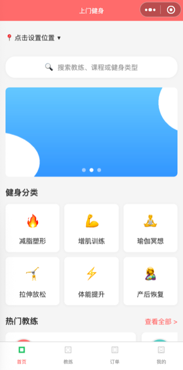
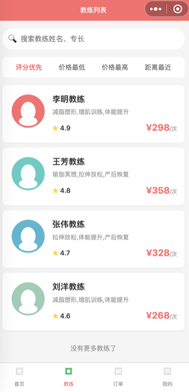
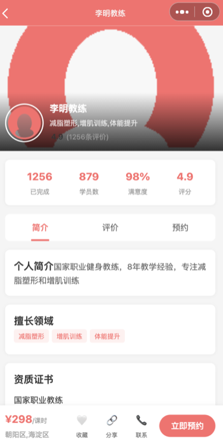
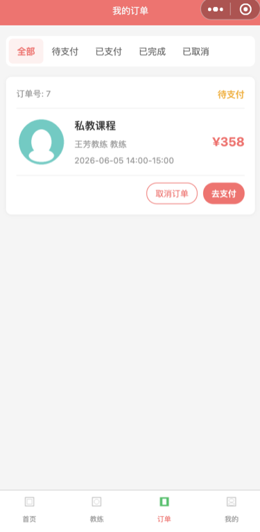
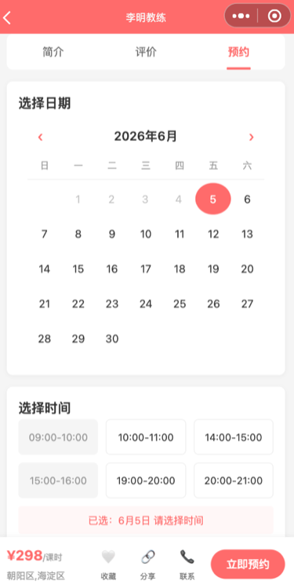
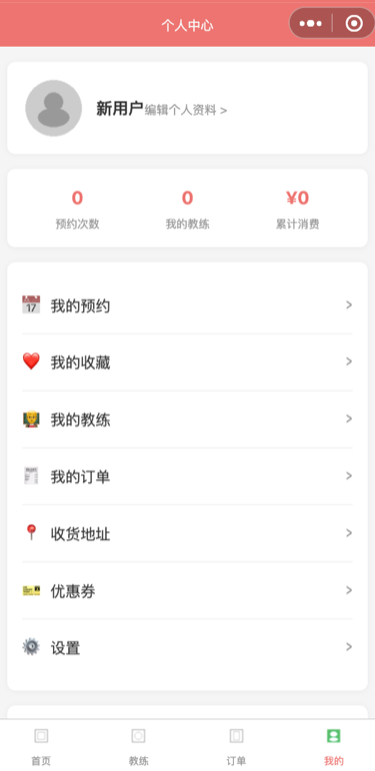
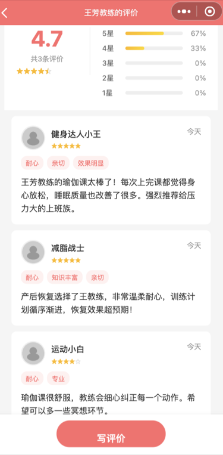
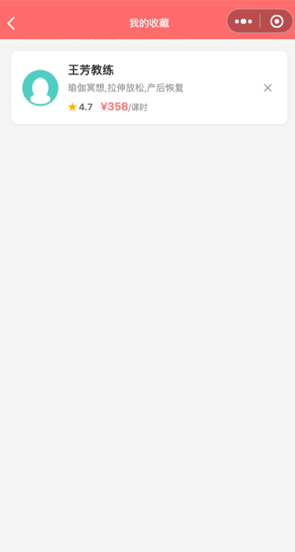

# 🏋️ HomeFitness - 上门健身微信小程序

专业教练上门健身服务的微信小程序全栈项目。

## 截图预览

<p align="center">
  
  
  
  
</p>

<p align="center">
  
  
  
  
</p>

> 📸 截图更新中，欢迎 PR 补充真实截图

## 项目结构

```
HomeFitness-repo/
├── client/                # 微信小程序前端
│   ├── pages/             # 页面（主包 + 子包）
│   ├── components/        # 自定义组件
│   ├── services/          # API 服务层
│   ├── utils/             # 工具函数
│   ├── images/            # 图片资源
│   └── scripts/           # 辅助脚本
└── server/                # Express 后端服务
    ├── src/
    │   ├── routes/        # API 路由
    │   ├── models/        # 数据模型
    │   └── middleware/    # 中间件
    ├── data/              # SQLite 数据库（运行时生成）
    └── uploads/           # 上传文件（运行时生成）
```

## 功能特性

- 🏠 **首页** — 轮播图、健身分类、热门教练推荐、位置定位
- 🏋️ **教练** — 教练列表/详情、分类筛选、关键词搜索、日历选日期预约
- 📋 **订单** — 预约确认、微信支付、订单管理、取消订单
- 👤 **我的** — 个人中心、预约管理、收藏教练、地址管理、优惠券
- ⭐ **评价** — 教练评分评价、星级组件
- 🔔 **订阅消息** — 预约提醒通知
- 🔒 **隐私合规** — 隐私授权弹窗、用户协议

## 技术栈

| 层级 | 技术 |
|------|------|
| 前端 | 微信小程序原生（WXML/WXSS/JS） |
| 后端 | Express.js + sql.js（零外部数据库依赖） |
| 认证 | JWT + 微信登录 |
| 支付 | 微信支付 v3 |
| 数据库 | SQLite（sql.js 纯 JS 实现） |

## 快速开始

### 1. 后端

```bash
cd server
npm install
cp .env.example .env   # 编辑 .env 填入真实配置
npm start
```

访问 `http://localhost:3000/health` 验证服务启动。

### 2. 前端

1. 用微信开发者工具打开 `client/` 目录
2. 修改 `client/app.js` 中的 API 地址
3. 勾选「不校验合法域名」
4. 编译运行

### 3. 种子数据

后端首次启动自动创建：4 位教练、6 个分类、3 张轮播图、8 门课程。

## API 概览

| 模块 | 端点 | 说明 |
|------|------|------|
| 首页 | `GET /api/home` | 轮播图 + 分类 + 热门教练 |
| 教练 | `GET /api/coaches` | 列表（搜索/分类/排序） |
| 认证 | `POST /api/auth/login` | 微信登录 |
| 预约 | `POST /api/bookings` | 创建预约 |
| 订单 | `POST /api/orders` | 创建订单 |
| 收藏 | `POST /api/favorites/:coachId` | 收藏教练 |
| 评价 | `POST /api/reviews` | 提交评价 |

完整 API 文档见 [server/README.md](server/README.md)。

## 上线前检查清单

- [ ] 后端部署到生产环境（HTTPS）
- [ ] API 域名配置到微信小程序后台
- [ ] 替换 `.env` 中的 JWT_SECRET 和微信配置
- [ ] 申请微信支付商户号并配置
- [ ] 申请订阅消息模板 ID
- [ ] 申请腾讯地图 Key（首页逆地理编码）
- [ ] 替换占位图片为真实素材

## License

MIT
